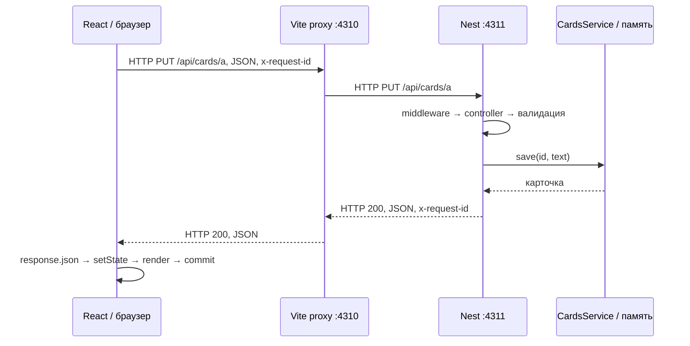

# Playground

Два небольших кейса для совместной отладки на React + NestJS. В каждом сначала
есть успешный пользовательский путь, затем явно включаемые поломки.
Нужен только Node.js 24 и pnpm 12. Docker, аккаунты и ключи не нужны.

```sh
pnpm install
pnpm dev
```

- http://127.0.0.1:4310/cards — сохранение карточек, гонка ответов, сеть.
- http://127.0.0.1:4310/runtime — генерация, блокировка Node и браузера.
- API: `127.0.0.1:4311`, Node Inspector: `127.0.0.1:9230`.

Оба процесса слушают loopback. Ctrl+C останавливает весь playground.
Изменения TS пересобираются, API перезапускается, React обновляется через Vite.
Карточки хранятся в памяти: обновление страницы их сохраняет, перезапуск API
сбрасывает. Это локальная учебная среда; build не запускает сервер раздачи фронта.

## Где смотреть код

| Участок | Файл |
| --- | --- |
| Загрузка, сохранение и отображение карточки | `client/cards-page.tsx` |
| Общий fetch и ID запроса | `client/api.ts` |
| Генерация и индикаторы браузера | `client/runtime-page.tsx` |
| Прокси | `vite.config.mts` |
| HTTP-логирование, заголовки, Nest module | `server/app.ts` |
| Контроллер, валидация и задержки | `server/lab.controller.ts` |
| Хранилище карточек | `server/cards.service.ts` |

## Путь запроса



До HTTP нужен адрес и соединение: имя → разрешение адреса → TCP → HTTP
(для HTTPS между TCP и HTTP добавляется TLS). Здесь URL использует IP, поэтому
у браузера нет DNS-запроса для этого адреса. `localhost` также часто разрешается
локально, а не через внешний DNS. Соединение может переиспользоваться.

Браузер обращается к Vite; Vite создаёт отдельный запрос к Nest. В DNS-эксперименте
имя `playground.invalid` разрешает **процесс прокси**. Поэтому в браузере виден
HTTP 502 от Vite, в терминале Vite — ошибка DNS, а Nest запроса не получает.
Это не симуляция браузерной DNS-ошибки. Чтобы увидеть её отдельно, откройте
`http://playground.invalid` напрямую (без корпоративного HTTP-прокси).
Vite здесь выполняет роль локального reverse proxy; VPN, балансировщика и TLS
в стенде нет. Между браузером и API нет CORS-перехода: для браузера origin один.

## Дебаг

1. Запустите `pnpm dev`.
2. В VS Code выберите **Playground: browser + server** и нажмите F5.
   Либо подключите Node через `chrome://inspect`, а фронт откройте с DevTools.
3. На `/cards` поставьте breakpoint перед `fetch` в `client/api.ts`, в
   `saveCard`, в `CardsService.save` и после `await request` на клиенте.
4. Сохраните текст. На каждой стороне смотрите аргументы, стек, JSON и ID.
   Через сеть нельзя перейти одним Step Into: продолжите выполнение на клиенте,
   затем сработает breakpoint другого процесса. Vite — третий процесс; его
   проксирование видно в Network и терминале, compound подключает клиент и Nest.
5. Сопоставьте `x-request-id` в Network с Console и терминалом API.

Source maps включены у клиента и сервера. Порты фиксированы, чтобы breakpoint
и URL не менялись. Если они заняты, остановите предыдущий экземпляр.
Пауза Node Inspector останавливает JS сервера, включая `/health`; задержки для
сравнения режимов измеряйте **без breakpoint**.

## Задания для менти

Начинайте с наблюдаемого симптома. Сначала гипотеза и способ её проверить,
потом изменение кода. Режимы переключаются через select; решение не нужно
искать в этом README до собственного расследования.

**Карточки.** Сохраните новый текст в А и перезагрузите страницу. В рабочем
режиме быстро переключите Б → А → Б и дождитесь всех ответов. Повторите в
эксперименте 1: совпадает ли выбранная карточка с текстом? Как доказать причину
по порядку запросов и ответов? Почините эксперимент без отключения задержек.
В экспериментах 2 и 3 определите самый дальний компонент, до которого дошёл
запрос. Объясните различие ошибок до исправления URL.

**Генерация.** Во всех режимах отправьте один и тот же запрос. Во время ожидания
нажимайте счётчик, смотрите таймер и `/health` в Network. Для эксперимента 2
запишите Performance-профиль с момента нажатия до результата. Отделите ожидание
сети от работы JS. Объясните, почему `async` не гарантирует отзывчивость.
Таймер показывает число выполненных callback, а не точные часы: пропущенные
во время блокировки интервалы не «догоняются».

Практическое продолжение: добавить создание карточки с валидацией на сервере
или заменить тяжёлое вычисление на worker и проверить отзывчивость теми же
измерениями. Эти функции специально оставлены для совместной реализации.

<details>
<summary>Для ментора: причины и ожидаемые наблюдения</summary>

- Карточки / рабочий режим: cleanup эффекта запрещает применять старый ответ.
  Запрос А занимает 1400 мс, Б — 150 мс. Отмена применения результата не отменяет
  сам HTTP-запрос; можно отдельно обсудить AbortController.
- Эксперимент 1 намеренно обходит эту защиту. Ответ А перезаписывает текст уже
  выбранной Б. Сохранение после этого запишет текст в выбранную Б — ещё один
  повод обсудить последствия, а не только визуальный симптом.
- Эксперимент 2: Vite не может разрешить `.invalid`, до Nest запрос не доходит.
- Эксперимент 3: прокси отправляет `/api/missing/cards/...`; Nest отвечает 404,
  middleware пишет лог, метод контроллера не вызывается.
- Генерация / рабочий режим: таймер освобождает JS-поток на время ожидания.
  Он моделирует ожидание I/O, но не обращается к реальной модели.
- Эксперимент 1: ограниченный busy loop в Node задерживает другие запросы.
  Таймер браузера продолжает работать; `/health` ждёт сервер.
- Эксперимент 2: после обычного HTTP-ответа такой же цикл выполняется в браузере.
  Его таймер и обработка кликов останавливаются; отдельный curl к API работает.
- UI-замер `/health` включает задержку обработки на клиенте. Для разделения
  причин используйте Waterfall, Performance и запрос из другого процесса.
- V8 исполняет JS; таймеры, сетевой I/O и рендеринг предоставляет окружение.
  `await` отдаёт управление, когда выполнение дошло до ожидания незавершённого
  promise; не переносит оставшиеся вычисления в другой поток.

</details>

## Проверки

```sh
pnpm check
pnpm build
pnpm test
pnpm exec playwright install chromium
pnpm test:browser
```

Browser-тесты сами запускают стенд; перед ними остановите `pnpm dev`.
Для установленного Chromium можно использовать
`CHROMIUM_PATH=/path/to/chromium pnpm test:browser`.
Проверяются сохранение через HTTP, валидация, порядок ответов, обе сетевые
поломки и независимость блокировок сервера/браузера. Тест учебного бага
фиксирует его воспроизводимость; после решения задачи замените ожидание
ошибочного поведения на ожидание корректного.

Материалы: [NestJS request lifecycle](https://docs.nestjs.com/faq/request-lifecycle),
[Node: Don't block the event loop](https://nodejs.org/en/learn/asynchronous-work/dont-block-the-event-loop).
